# HEALTH ID

### Your data. Your life.

Health ID is a patient-controlled clinical-trial matching demo: the trial's
criteria travel to the patient's data, a real AI agent closes the one missing
eligibility fact, and the patient approves a minimum-disclosure eligibility
proof — so a research site is matched without ever seeing the chart.

## Demo

_Live demo: https://health-id-hack.vercel.app_
_Demo Video: https://youtu.be/o43bcc42mc8


## Product thesis

**Bring the trial criteria to the patient graph — not patient records to
pharma.**

Trial matching today moves records outward: a patient's full chart is shipped
somewhere to be checked against eligibility criteria. Health ID inverts that.
Structured trial criteria travel to the patient's **patient graph** — a
source-preserving summary of the patient's own facts — and only the minimum
disclosure needed to prove eligibility ever leaves the patient's control. The
patient, not the site or the sponsor, decides what is shared.

## What the demo proves

> **The agent found the patient without exposing the patient. Then the patient
> chose what the trial could see.**

- Eligibility is evaluated across a cohort with **zero identifiable records
  disclosed**.
- A real agent closes an eligibility gap by retrieving an external record and
  re-evaluating one criterion, while preserving the original source.
- The patient grants a **minimum-disclosure** eligibility proof and can revoke
  it; the research site sees a criteria-level match, never the chart.
- Requests outside the consented scope are **blocked**.

## The 5-beat flow

Keyboard: `→` advances (once a beat is unlocked), `←` goes back, and `r`
resets. The on-screen **Back** and **Start over** buttons do the same.

1. **Fragmented data → patient graph** — four disconnected sources (hospital
   EHR, external pathology lab, previous oncology clinic, and a
   patient-uploaded record) link into one private patient graph centered on
   `P-007`.
2. **Private cohort scan** — a trial is imported from ClinicalTrials.gov, then
   its criteria are evaluated against 10 patient graphs into likely eligible,
   eligibility unknown, and ineligible — with **0 identifiable records
   disclosed**.
3. **The eligibility gap (UNKNOWN → MATCH)** — `P-007` opens on its one
   blocking eligibility gap (HER2-low status). `Find missing evidence` runs the
   real Claude gap resolver, which streams a visible agent trace, surfaces a
   source-preserving pathology proof, and flips the criterion to PASS.
4. **Your Health ID (consent wallet)** — the patient sees exactly what will be
   shared versus withheld, then approves a minimum-disclosure eligibility proof
   (revocable after the fact).
5. **Research site eligibility proof** — the research site sees only a
   consented, criteria-level match; requesting the full record is explicitly
   blocked.

## Architecture

```mermaid
flowchart LR
  CT[ClinicalTrials.gov] --> TI[Trial Import · deterministic fetch]
  TI --> CR[Structured Criteria · modeled on study]
  CR --> PG[10 Synthetic Patient Graphs]
  PG --> GR[Gap Resolver · real Claude agent]
  GR --> TOOL[search_external_records tool]
  TOOL --> EV[Source-Preserving Evidence]
  EV --> VERIFY[Criterion Re-evaluation]
  VERIFY --> CONSENT[Patient Consent Gate]
  CONSENT --> PROOF[Minimum Eligibility Proof]
  PROOF --> SITE[Research Site]
```



## Where the real AI is

Be precise about what is and isn't an agent:

- **One real Claude agent — the gap resolver.** `app/api/resolve-gap/route.ts`
  uses the Anthropic SDK, offers the `search_external_records` tool, receives
  the tool result, and re-evaluates criterion **C03** (HER2 status). It runs a
  genuine tool-use loop and replies in strict JSON.
- **Trial import is a deterministic fetch of real ClinicalTrials.gov data — no
  Claude, no LLM in that route.** `app/api/import-trial/route.ts` fetches the
  live study `NCT03734029` (with a cached registry fallback) and reads the
  fields directly from the JSON.
- **Deterministic application logic** bounds the agent's turns and time,
  validates the response shape, provides a fallback when the model is
  unavailable or replies unparseably, controls the consent and disclosure gate,
  and **never performs final enrollment**.

## Trust and safety

- **Minimum disclosure by design.** Only the fields required to prove
  eligibility are shared; the full record is never transmitted, and
  out-of-scope requests are blocked.
- **Patient-controlled.** Consent is explicit, scoped, time-boxed, and
  revocable.
- **Source-preserving.** Every fact is traceable to its original source, and
  the original text is retained alongside any normalization.
- **Bounded agent.** Turn count and wall-clock time are capped, and every model
  reply is schema-validated with a deterministic fallback.
- **No final decisions by AI.** The system surfaces *likely* eligibility for
  human screening; it does not enroll anyone.

## Data provenance

- **NCT03734029 is a real ClinicalTrials.gov study.** The import route
  fetches live registry data, with a cached registry copy as a fallback.
- **The 12 eligibility criteria are structured criteria _modeled on_ the
  study (DESTINY-Breast04)** — they are not auto-parsed from the registry
  text.
- **All 10 patient graphs are entirely synthetic.**
- **The Brazilian pathology record is a synthetic demo fixture.**
- **Terminology normalization (IHQ → IHC) is a demo fixture,** not a
  universal clinical mapping.
- **Likely eligibility is not final eligibility;** formal screening is
  required.

## Limitations

- Synthetic patients and a single modeled trial; not validated against real
  cohorts.
- Criteria are modeled by hand, not parsed from free-text eligibility.
- External-record retrieval and terminology mapping are demo fixtures, not
  integrations with real record networks or terminology services.
- No authentication, persistence, or real identity and consent infrastructure.
- Not a medical device; it makes no treatment, coverage, or enrollment
  decisions.

## Stack

- **Next.js 16** (App Router, Turbopack)
- **TypeScript**
- **Anthropic SDK** (`@anthropic-ai/sdk`) for the gap-resolver agent
- **Tailwind CSS**

## Repo structure

```text
app/
  page.tsx                  # beat state machine (client)
  layout.tsx, globals.css
  api/
    import-trial/route.ts   # deterministic ClinicalTrials.gov fetch (no LLM)
    resolve-gap/route.ts    # real Claude agent + search_external_records tool
components/                 # one screen per beat, plus TopBar
  ScreenFragments.tsx, ScreenCohort.tsx, ScreenCandidate.tsx,
  ScreenConsent.tsx, ScreenSite.tsx, TopBar.tsx
lib/
  types.ts                  # shared domain types
  data.ts                   # typed loaders over the fixtures
data/
  trial.json                # 12 structured criteria modeled on DESTINY-Breast04
  cohort-results.json       # per-patient evaluation results
  patients/                 # 10 synthetic patient graphs
  external/
    nct03734029-cached.json # cached ClinicalTrials.gov registry copy (fallback)
    pathology-p007.json     # synthetic cross-border pathology fixture
  resolved-p007.json        # deterministic fallback for the gap resolver
```

## Local setup

```bash
npm i
```

Add your Anthropic API key to `.env.local`. This is optional: the gap resolver
falls back to a fixture when the key is absent, so the demo always completes.

```ini
ANTHROPIC_API_KEY=sk-ant-...
```

```bash
npm run dev
```

Open [http://localhost:3000](http://localhost:3000) and drive the demo with the
arrow keys or the on-screen controls.

## Hackathon build disclosure

This is a hackathon prototype built to demonstrate a product direction, not a
production system. Trial import uses real ClinicalTrials.gov data, and the
eligibility criteria are modeled on a real study; everything about the
patients, the external pathology record, and the terminology mapping is
synthetic demo data. Nothing here should be used for real treatment, coverage,
screening, or enrollment decisions.
